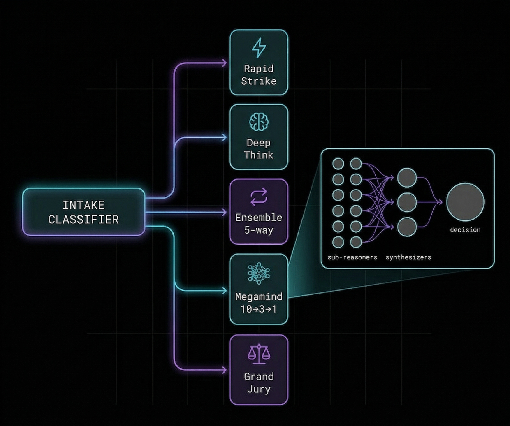

# UltraThink 2.0

**Reasoning skills for Claude Code that actually make it think.**

> AI's failure mode isn't "can't reason" — it's pattern completion bias.
> These skills force investigation before reasoning, and reasoning before changes.



## Install (One Command)

```bash
# Creates .claude/skills/ and downloads UltraThink 2.0
mkdir -p .claude/skills && curl -sL https://raw.githubusercontent.com/alexalexalex222/ultrathink-2.0/main/skills/ultrathink2-SKILL.md -o .claude/skills/ultrathink2-SKILL.md
```

**Want all 4 skills?**
```bash
mkdir -p .claude/skills && for f in ultrathink2-SKILL.md deepthink-SKILL.md megamind-SKILL.md diamondthink-SKILL.md; do curl -sL "https://raw.githubusercontent.com/alexalexalex222/ultrathink-2.0/main/skills/$f" -o ".claude/skills/$f"; done
```

That's it. Open Claude Code in your project and the skills are live.

---

## The Problem

Every AI coding assistant has the same failure loop:

```
see familiar pattern → stop reading → predict from training data → patch → fail → repeat
```

UltraThink breaks this loop by forcing structured reasoning *before* the model touches code.

---

## How It Works

UltraThink auto-classifies any task and selects the right reasoning depth:

| Mode | When | Architecture |
|------|------|-------------|
| **Rapid Strike** | Low stakes, obvious answer | Quick confidence check |
| **Deep Think** | Medium tasks | 11 sequential reasoning techniques |
| **Ensemble** | High complexity | 5-way parallel sub-reasoners |
| **Megamind** | Extreme complexity | 10 angles → 3 synthesizers → 1 decision |
| **Grand Jury** | Debugging / prior failures | Courtroom-standard investigation |

If confidence drops below threshold, it automatically escalates to the next mode.

### Usage
```
/ultrathink          → auto-select mode
/ultrathink deep     → force 11-technique reasoning
/ultrathink ensemble → force 5-way parallel
/ultrathink mega     → force 10→3→1 architecture
/ultrathink jury     → force investigation protocol
/ultrathink max      → megamind + grand jury combined
```

---

## Context Management & Token Costs

This is the real reason UltraThink exists in skill form instead of hardcoded prompts.

### The Context Problem

Claude Code has a finite context window. Heavy reasoning eats tokens fast. If you run Megamind (10 angle-explorers + 3 synthesizers) in-context, you've burned 50K+ tokens on reasoning alone — leaving less room for your actual codebase.

### How UltraThink Solves It

**1. Adaptive depth = no wasted tokens**

Most tasks don't need maximum reasoning. UltraThink's auto-classifier prevents you from burning 50K tokens on a task that only needs 2K. The matrix:

| Mode | Context Cost | When It's Used |
|------|-------------|----------------|
| Rapid Strike | ~2-5K tokens | Quick fixes, obvious answers |
| Deep Think | ~10-20K tokens | Medium complexity, single-file |
| Ensemble | ~20-40K tokens | High complexity, multiple approaches needed |
| Megamind | ~40-80K tokens | Extreme complexity, architecture decisions |
| Grand Jury | Variable (evidence-gated) | Debugging, investigation, prior failures |

**2. Parallel subprocess execution = reasoning without context cost**

Instead of running 10 angle-explorers inside your main context (50K+ tokens), UltraThink spawns them as separate Claude processes via CLI:

```bash
# 10 parallel reasoners, each in their own context
for i in 1 2 3 4 5 6 7 8 9 10; do
  claude -p "ANGLE $i: [problem]" --model opus > /tmp/ut2-angle$i.md &
done
wait
```

The main context only receives the final outputs (~500 tokens total), not the full reasoning traces. This means:

| Method | Context Cost |
|--------|-------------|
| In-context Megamind | **50K+ tokens** (reasoning fills your window) |
| In-context Ensemble | **30K+ tokens** |
| In-context Deep Think | **20K+ tokens** |
| **Subprocess (any mode)** | **~500 tokens** (just the outputs) |

You get the same reasoning depth at 1/100th the context cost.

**3. Confidence-gated escalation = efficient by default**

UltraThink starts with the lightest mode that could work. It only escalates when confidence drops below 7. This means 80% of tasks resolve at Rapid Strike or Deep Think cost, and you only pay the full Megamind price when it's genuinely needed.

---

## Skills Included

### 🧠 UltraThink 2.0 — The Unified Engine (732 lines)
> [`skills/ultrathink2-SKILL.md`](skills/ultrathink2-SKILL.md)

The main skill. Auto-classifies, auto-selects depth, auto-escalates. Includes all modes, subprocess execution templates, confidence calibration, and anti-shortcut detection.

### ⚡ Deep Think (161 lines)
> [`skills/deepthink-SKILL.md`](skills/deepthink-SKILL.md)

11 sequential reasoning techniques: Meta-cognition → Step-back → Decomposition → Tree of Thought → First Principles → Analogical Reasoning → Chain of Thought → Devil's Advocate → Inversion → RAVEN Loop → Recursive Self-Improvement. Every checkpoint mandatory.

### 🌀 Megamind (172 lines)
> [`skills/megamind-SKILL.md`](skills/megamind-SKILL.md)

Maximum depth: 10 angle-explorers (performance, security, edge cases, devil's advocate, scalability, beginner's mind, future self, user perspective, constraint breaker, simplicity) → 3 synthesizers (consensus, conflict, risk) → 1 final decision. Loops until confident.

### ⚖️ DiamondThink — Grand Jury (173 lines)
> [`skills/diamondthink-SKILL.md`](skills/diamondthink-SKILL.md)

Courtroom-standard debugging: symptom lock → territory map → assumptions ledger → search pass → evidence ledger (verbatim excerpts + line numbers) → chain-of-custody → murder board (4+ hypotheses with evidence FOR and AGAINST) → pre-flight → one atomic fix. No claim without evidence. No retry without new data.

---

## 1,238 Lines Total

All MIT licensed. Use them, break them, improve them.

---

**Built by [@neuralwhisperer](https://x.com/neuralwhisperer)**
